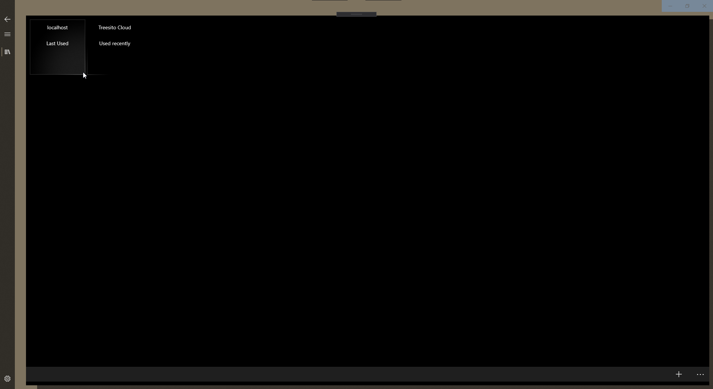
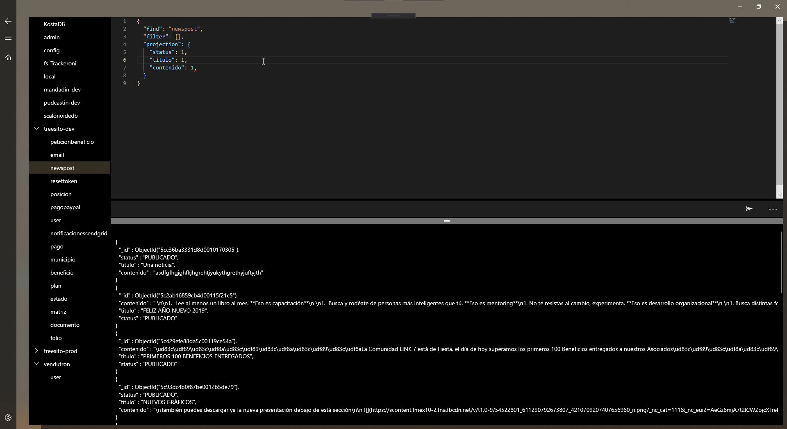

# Yup
Say Hello to `Yup` a proof of concept that there can be good tooling for developers in UWP

Yup is a proof of concept of a mongodb database manager with the most basic stuff in place
Storing multiple connections

and doing simple queries

this also leverages the Monaco Editor to be able to do your queries
when you have a collection selected you actually send a [MongoDB Database Command](https://docs.mongodb.com/manual/reference/command/)
that includes of course [CRUD Command Operations](https://docs.mongodb.com/manual/reference/command/#query-and-write-operation-commands).

Right now it only supports find queries (haven't really tested write operations, but theoretically you should be able to send any valid MongoDB command though showing the response is not something I've worked on).

This uses [WinUI](https://github.com/Microsoft/microsoft-ui-xaml) as well as the [Windows Community Toolkit](https://github.com/windows-toolkit/WindowsCommunityToolkit)